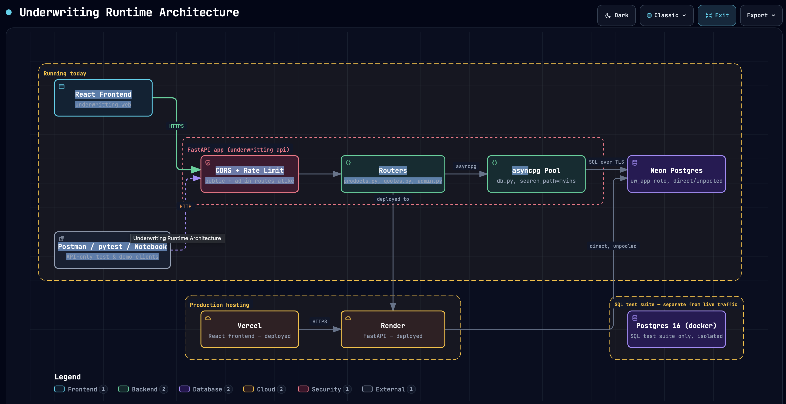

# 🛡️ Insurance Underwriting Rules Engine

A data-driven insurance underwriting engine built with PostgreSQL and exposed through a FastAPI API.

The project demonstrates how complex business rules can be modeled as data rather than hard-coded application logic, making products and underwriting rules easier to change without modifying the application layer.

## 🎯 Business Problem

Insurance products often contain large numbers of underwriting questions and rules.

A traditional implementation can place these rules directly in application code, making changes expensive and difficult to audit.

This project explores a different approach:

> **What if underwriting rules were data?**

Products, questions, conditions, outcomes and evaluation behavior are stored in PostgreSQL. The database evaluates the rules and records the resulting decision.

## 💡 Solution

The system supports an end-to-end quote workflow:

1. Select an insurance product
2. Retrieve its questions
3. Capture applicant answers
4. Validate answers
5. Evaluate underwriting rules
6. Produce an underwriting outcome
7. Record the evaluation for auditability

Possible outcomes include:

- `accept`
- `increase_premium`
- `refer_to_insurer`
- `decline`

A live demo of the engine is available at [paco-uw-web.vercel.app](https://paco-uw-web.vercel.app/).

## 🏗️ Architecture

  

  <a href="https://pacordev.github.io/paco_uw/diagrams/underwriting-architecture.html">View the full architecture diagram interactively</a>

The solution is divided into two major layers:

**PostgreSQL Rules Engine**

Contains the data model, business rules and evaluation functions.

**FastAPI API**

Provides HTTP endpoints for products, questions, quotes, answers and evaluations.

The API intentionally contains minimal business logic. The underwriting decision remains in the database layer.

## 🧠 Engineering Highlights

- Data-driven business rules
- Compound rule conditions
- Full evaluation and short-circuit evaluation strategies
- Evaluation history and auditability
- Input validation at the database level
- Quote access tokens
- API rate limiting
- CORS controls
- Automated API tests
- Dockerized PostgreSQL environment
- Interactive architecture documentation

## 🧪 Testing

The PostgreSQL rules engine includes an 80-assertion test suite covering the rule engine and demonstration scenarios.

The FastAPI layer includes contract and integration tests covering health checks, products, quotes, evaluation, CORS, rate limiting, request limits and administrative endpoints.

## 🛠️ Technology

Python · FastAPI · PostgreSQL · asyncpg · Docker · pytest · SQL